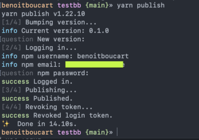
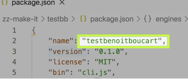
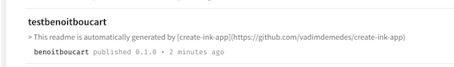
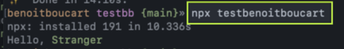
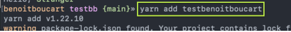

# Een project publiceren
We willen dat andere mensen onze app kunnen installeren. Hiervoor moeten we deze registreren op de NPM registry.
Maak een account aan op [npmjs.com](https://npmjs.com)

Een project publiceren kan als volgt:
`yarn publish`

Opgelet: zorg dat de name in je `package.json` uniek is (dit kan je checken door te zoeken op de naam op [npmjs.com](https://npmjs.com)):

Als je nu gaat naar je [NPM profiel](https://www.npmjs.com/settings/benoitboucart/packages), zou je de package moeten terugvinden:

Je kan nu, op een andere of dezelfde laptop, je command line app installeren / gebruiken als volgt:

**Ter info:** Aangezien dit publiekelijk is, kan je deze package nu ook installeren als dependency in andere projecten:

Zie: [yarn publish documentatie](https://yarnpkg.com/en/docs/cli/publish)

_When you publish a package with Yarn it goes onto the npm registry which is used to distribute packages globally._
